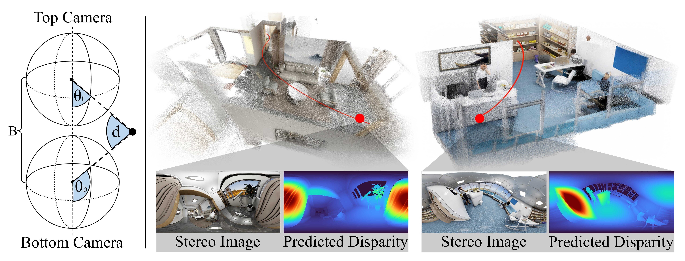
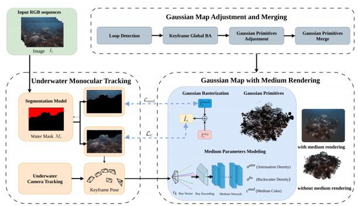
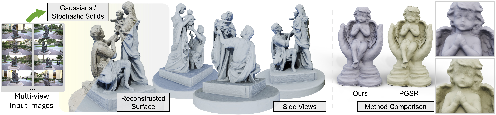

<html>
    <table style="width:100%;border:0px;border-spacing:0px;border-collapse:separate;margin-right:auto;margin-left:auto;">
          <tr onmouseout="nightsight_stop()" onmouseover="nightsight_start()">
            <td style="padding:20px;width:25%;vertical-align:middle;border-left-style:none;border-bottom-style:none;border-top-style:none;border-right-style:none">
              
            </td>
            <td style="padding:20px;width:75%;vertical-align:middle;border-left-style:none;border-bottom-style:none;border-top-style:none;border-right-style:none">
                <papertitle>H2-Mapping: Real-time Dense Mapping Using Hierarchical Hybrid Representation
                </papertitle>
               
                <strong>Chenxing Jiang</strong>, Hanwen Zhang, Peize Liu, Zehuan Yu, Hui Cheng, Boyu Zhou, Shaojie Shen
               
              <em>IEEE Robotics and Automation Letters, 2023. <strong>(Best Paper Award)</strong> </em> 
              
              
              
                
              
              
            </td>
          </tr>
    </table>
    <table style="width:100%;border:0px;border-spacing:0px;border-collapse:separate;margin-right:auto;margin-left:auto;">
          <tr onmouseout="nightsight_stop()" onmouseover="nightsight_start()">
            <td style="padding:20px;width:25%;vertical-align:middle;border-left-style:none;border-bottom-style:none;border-top-style:none;border-right-style:none">
              
            </td>
            <td style="padding:20px;width:75%;vertical-align:middle;border-left-style:none;border-bottom-style:none;border-top-style:none;border-right-style:none">
                <papertitle>H3-Mapping: Quasi-Heterogeneous Feature Grids for Real-time Dense Mapping Using Hierarchical Hybrid Representation
                </papertitle>
               
                <strong>Chenxing Jiang</strong>, Yiming Luo, Boyu Zhou, Shaojie Shen
               
              <em>IEEE Robotics and Automation Letters, 2024.</em> 
              
              
              
              
              
            </td>
          </tr>
    </table>
    <table style="width:100%;border:0px;border-spacing:0px;border-collapse:separate;margin-right:auto;margin-left:auto;">
          <tr onmouseout="nightsight_stop()" onmouseover="nightsight_start()">
            <td style="padding:20px;width:25%;vertical-align:middle;border-left-style:none;border-bottom-style:none;border-top-style:none;border-right-style:none">
              
            </td>
            <td style="padding:20px;width:75%;vertical-align:middle;border-left-style:none;border-bottom-style:none;border-top-style:none;border-right-style:none">
                <papertitle>WING: Wheel-Inertial-Neural Odometry with Ground Manifold Constraints
                </papertitle>
               
                <strong>Chenxing Jiang</strong>, Kunyi Zhang, Sheng Yang, Shaojie Shen, Chao Xu, Fei Gao
               
              <em>IEEE Transactions on Intelligent Vehicles, 2024.</em> 
              
              
            </td>
          </tr>
    </table>
    <table style="width:100%;border:0px;border-spacing:0px;border-collapse:separate;margin-right:auto;margin-left:auto;">
          <tr onmouseout="nightsight_stop()" onmouseover="nightsight_start()">
            <td style="padding:20px;width:25%;vertical-align:middle;border-left-style:none;border-bottom-style:none;border-top-style:none;border-right-style:none">
              
            </td>
            <td style="padding:20px;width:75%;vertical-align:middle;border-left-style:none;border-bottom-style:none;border-top-style:none;border-right-style:none">
                <papertitle>H-OmniStereo: Zero-Shot Omnidirectional Stereo Matching with Heading-Aligned Normal Priors
                </papertitle>
               
                <strong>Chenxing Jiang</strong>, Zhe Tong, Pusen Gao, Peize Liu, Yang Xu, Chuan Fang, Ping Tan, Shaojie Shen
               
              <!-- <em>   .</em>  -->
              
              
              
            </td>
          </tr>
    </table>
    <table style="width:100%;border:0px;border-spacing:0px;border-collapse:separate;margin-right:auto;margin-left:auto;">
          <tr onmouseout="nightsight_stop()" onmouseover="nightsight_start()">
            <td style="padding:20px;width:25%;vertical-align:middle;border-left-style:none;border-bottom-style:none;border-top-style:none;border-right-style:none">
              
            </td>
            <td style="padding:20px;width:75%;vertical-align:middle;border-left-style:none;border-bottom-style:none;border-top-style:none;border-right-style:none">
                <papertitle>WaterSplat-SLAM: Photorealistic Monocular SLAM in Underwater Environment
                </papertitle>
               
                Kangxu Wang*, Shaofeng Zou*, <strong>Chenxing Jiang*</strong>, Yixiang Dai, Siang Chen, Shaojie Shen, Guijin Wang <strong>(* Equation contribution)</strong>
               
              <em>IEEE Robotics and Automation Letters, 2026.</em> 
              <em>Robotics: Science and Systems workshop on Mapping the Reef: Underwater 3D Reconstruction for Coral Ecosystems, 2026. <strong>(Best Paper Award)</strong> </em> 
              
              <!--  -->
              
              <!-- 
               -->
            </td>
          </tr>
    </table>
    <table style="width:100%;border:0px;border-spacing:0px;border-collapse:separate;margin-right:auto;margin-left:auto;">
          <tr onmouseout="nightsight_stop()" onmouseover="nightsight_start()">
            <td style="padding:20px;width:25%;vertical-align:middle;border-left-style:none;border-bottom-style:none;border-top-style:none;border-right-style:none">
              
            </td>
            <td style="padding:20px;width:75%;vertical-align:middle;border-left-style:none;border-bottom-style:none;border-top-style:none;border-right-style:none">
                <papertitle>Geometry-Grounded Gaussian Splatting
                </papertitle>
               
                Baowen Zhang, <strong>Chenxing Jiang</strong>, Heng Li, Shaojie Shen, Ping Tan
               
              <!-- <em>   .</em>  -->
              
              
              
            </td>
          </tr>
    </table>
    <table style="width:100%;border:0px;border-spacing:0px;border-collapse:separate;margin-right:auto;margin-left:auto;">
          <tr onmouseout="nightsight_stop()" onmouseover="nightsight_start()">
            <td style="padding:20px;width:25%;vertical-align:middle;border-left-style:none;border-bottom-style:none;border-top-style:none;border-right-style:none">
              
            </td>
            <td style="padding:20px;width:75%;vertical-align:middle;border-left-style:none;border-bottom-style:none;border-top-style:none;border-right-style:none">
                <papertitle>DIDO:Deep Inertial Quadrotor Dynamical Odometry
                </papertitle>
               
                Kunyi Zhang, <strong>Chenxing Jiang</strong>, Jinghang Li, Sheng Yang, Teng Ma, Chao Xu, Fei Gao
               
              <em>IEEE Robotics and Automation Letters, 2022.</em> 
              
              
              
              
            </td>
          </tr>
    </table>
    <table style="width:100%;border:0px;border-spacing:0px;border-collapse:separate;margin-right:auto;margin-left:auto;">
          <tr onmouseout="nightsight_stop()" onmouseover="nightsight_start()">
            <td style="padding:20px;width:25%;vertical-align:middle;border-left-style:none;border-bottom-style:none;border-top-style:none;border-right-style:none">
              
            </td>
            <td style="padding:20px;width:75%;vertical-align:middle;border-left-style:none;border-bottom-style:none;border-top-style:none;border-right-style:none">
                <papertitle>MG-Grasp: Metric-Scale Geometric 6-DoF Grasping Framework with Sparse RGB Observations
                </papertitle>
               
                Kangxu Wang, Siang Chen, <strong>Chenxing Jiang</strong>, Shaojie Shen, Yixiang Dai, Guijin Wang
               
              <!-- <em>   .</em>  -->
              
              
              
            </td>
          </tr>
    </table>
</html>

